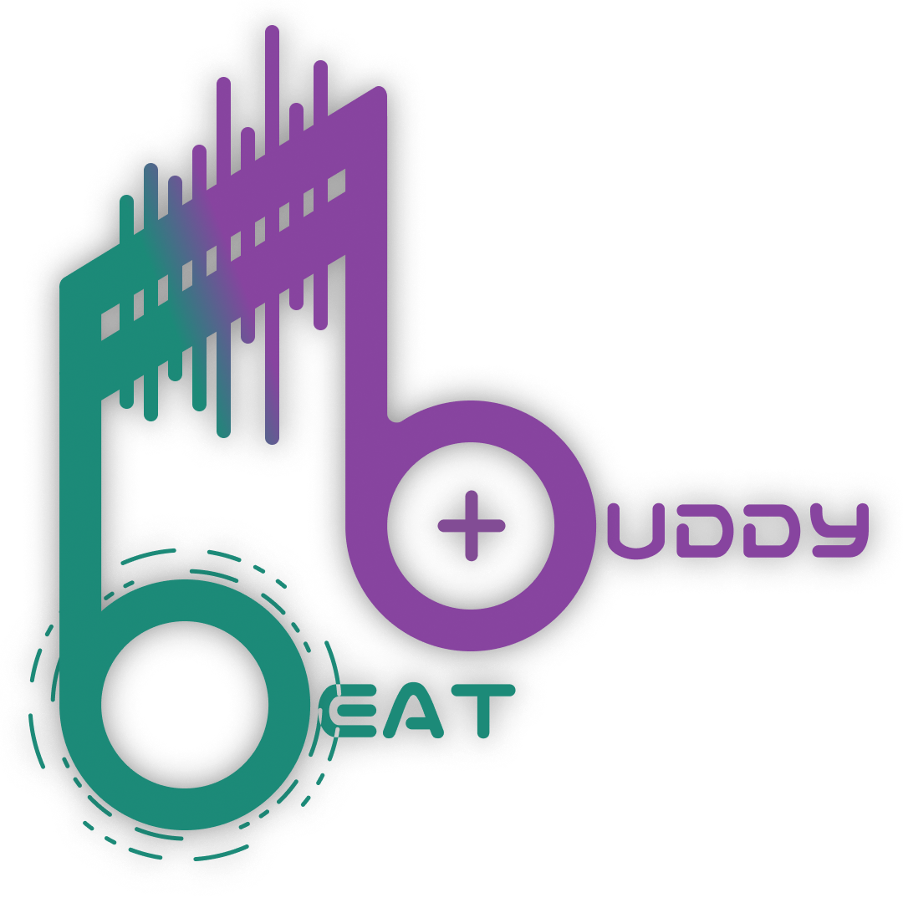

Project for the "**Large-Scale and Multi-Structured Databases**" class (2023-24) at Pisa University. 
Group work carried out by the students: [Luca Arduini](https://github.com/LucaArduini), [Enrico Giovanni Loni](https://github.com/genricoloni), [Lorenzo Mancinelli](https://github.com/loremancio).

# BeatBuddy

  

### Abstract
Welcome to BeatBuddy, your rhythmic playground! 🎶 This is where music pulses through the digitalspace, inviting you to discover vibes with friends, share your album crushes, and let the beats ofothers lead you to uncharted sonic adventures. Imagine a place where every review, every rating,and every note played is a stepping stone to your next musical revelation. 🎧

BeatBuddy isn't just about browsing; it's about discovering music that resonates with your personal taste. It's about the excitement of uncovering an artist's complete discography and the joy of finding detailed information on every album. Our recommendations engine is the compass that guides you to your next favorite track, fine-tuned by the musical preferences of your friends and your own listening history.

While you can't stream music directly from us, we make it easy to find new tunes to add to your personal playlist elsewhere. BeatBuddy is your backstage pass to the music world, the encyclopedia of albums and songs that stands ready to inform your next musical choice. Whether you're looking to delve into the details of your all-time favorite album or find the pulse of the latest hits, we’re here to amplify your experience.

So come on in, explore, share, and celebrate the diversity of music with BeatBuddy. Every login is a step into a vast auditorium, where every note matters and every album tells a story. Let's embark on this melodious adventure together. Ready to turn the page on your next musical chapter? 🎶📖

### Implementation
At its core, BeatBuddy is a web application thoughtfully crafted using Spring Boot, a robust framework that empowers rapid and agile development with its convention-over-configuration philosophy. Spring Boot's opinionated approach allows for streamlined development processes, enabling our team to focus more on the unique features of BeatBuddy and less on boilerplate code.

Underpinning the functionality of BeatBuddy are two sophisticated types of databases that harmonize to store and manage data. Firstly, we harness the power of **MongoDB**, a document-based database, known for its agility and scalability. It allows us to handle large volumes of structured and unstructured data, making it ideal for storing user profiles, reviews, and the rich metadata of albums and songs.

Complementing MongoDB is **Neo4j**, a graph database that excels in drawing connections and unveiling patterns within data. Its graph-based approach is perfectly attuned to mapping the complex relationships in the musical domain—linking artists, albums, songs, and user preferences in an intricate web of nodes and edges. This enables us to deliver personalized and relevant musical recommendations, tracing the threads of musical influence and user interactions with finesse.

The fusion of these databases with Spring Boot's dynamic backend creates a seamless, scalable, and responsive web application that meets the high notes of modern web standards and user expectations.

So, beyond the beats and beyond the playlists, BeatBuddy is a testament to the harmony of cutting-edge technology and a passion for music, all orchestrated to provide an unparalleled experience for every user.

  

